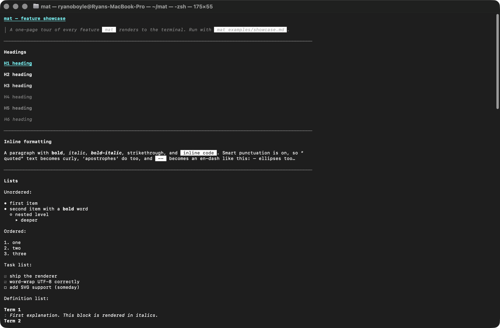
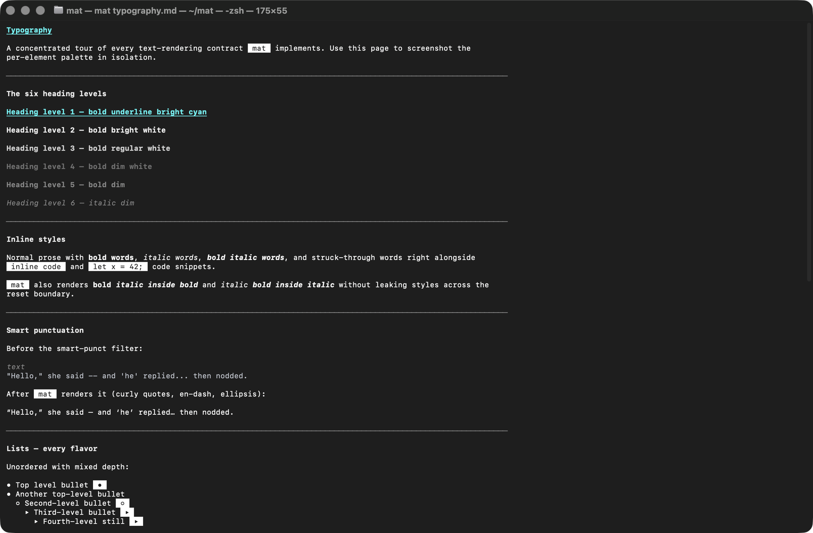
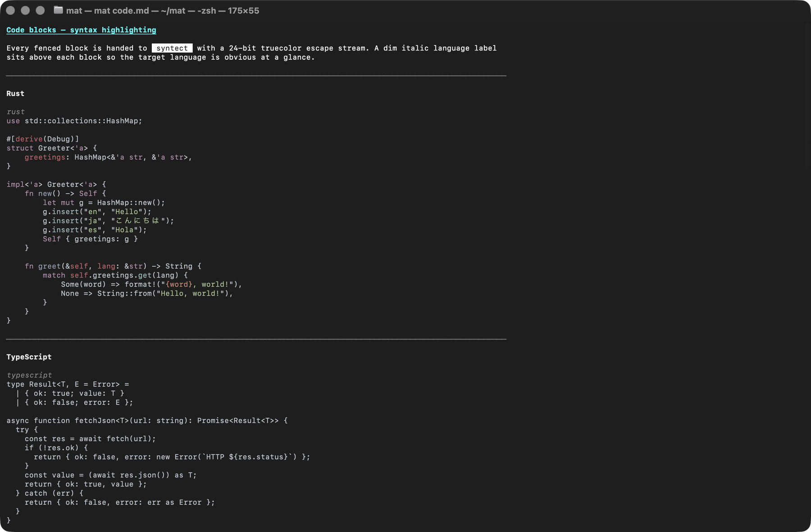
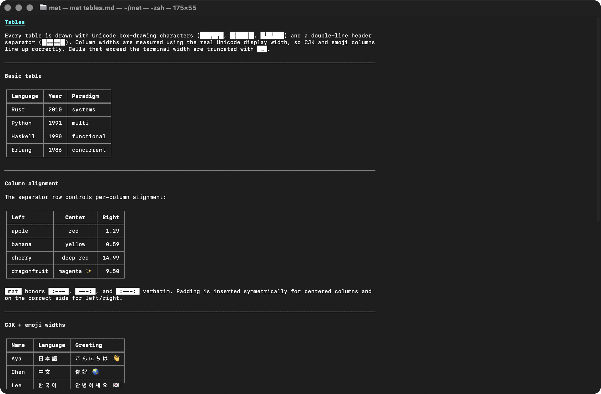
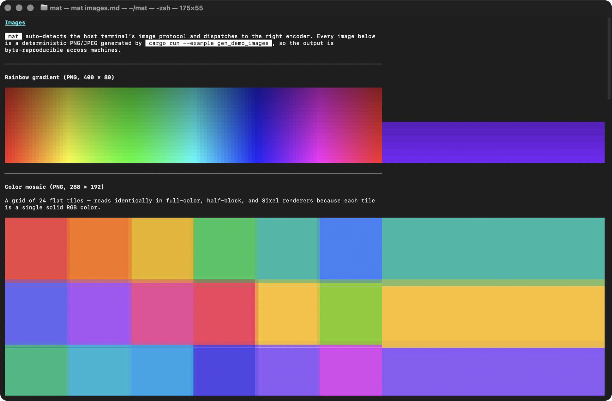
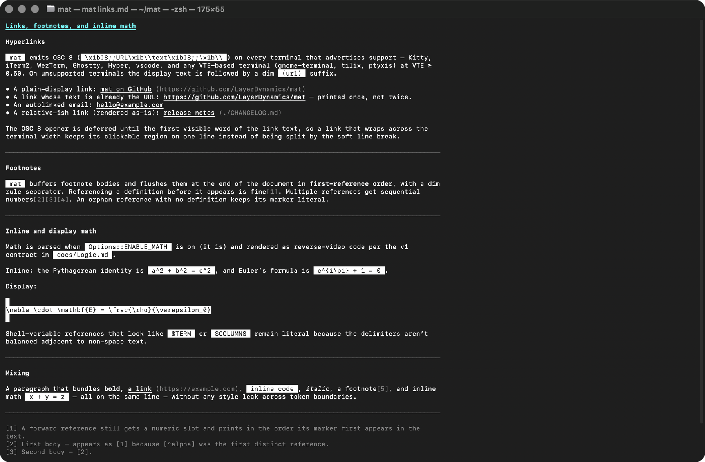

# mat

`mat` is `cat`, but specifically for markdown documents in the terminal — a single-binary Rust CLI that prints a fully-rendered markdown file to the terminal (ANSI styling, syntax-highlighted code blocks, Unicode tables, inline images via Kitty / iTerm2 / Sixel / half-block, OSC 8 hyperlinks).

When stdout is **not** a TTY, `mat` behaves exactly like `cat` (raw passthrough) unless you pass `--force-color`. This is the cat-compatibility contract.

## Install

### One-liner (Linux / macOS)

```bash
curl -fsSL https://raw.githubusercontent.com/LayerDynamics/mat/main/install.sh | bash
```

The installer prefers a prebuilt binary from the latest GitHub release, falling back to a source build if no prebuilt is available for your platform. Honors `$PREFIX`, `$MAT_VERSION`, `$FORCE_SOURCE`, and `$INSTALL_RUST`.

### One-liner (Windows / PowerShell)

```powershell
iwr -useb https://raw.githubusercontent.com/LayerDynamics/mat/main/install.ps1 | iex
```

Same resolution: prebuilt first, source build second. Sets the user `PATH` automatically.

### From source

```bash
git clone https://github.com/LayerDynamics/mat
cd mat
cargo build --release
./target/release/mat README.md
```

### From crates.io

```bash
cargo install mat
```

## Usage

```bash
mat README.md                  # render a file
mat docs/*.md                  # render multiple files
cat README.md | mat            # read from stdin (also: `mat -`)
mat --force-color README.md    # render even when stdout isn't a TTY
mat --no-color README.md       # disable ANSI escapes (also: $NO_COLOR)
mat --no-images README.md      # skip image rendering
mat --width 100 README.md      # override terminal width
mat --version                  # show version
mat --help                     # show full help
```

## Showcase

Every image below is a real macOS Terminal.app capture. `mat` renders each one inline via whichever image protocol your terminal supports (Kitty / iTerm2 / Sixel / half-block fallback) at full terminal width, preserving its natural aspect so text inside the screenshot stays readable. Set `MAT_IMAGE_MAX_HEIGHT_SCALE=1.0` if you want images capped to a single viewport-height of scroll; the default `2.5` lets landscape captures render at their native aspect without compressing the content inside them.

Scroll-through GIFs of every demo are also committed alongside the stills at `examples/screenshots/*.gif` for GitHub-rendered previews.

### `mat examples/showcase.md` — one-page tour



### `mat examples/typography.md` — headings, inline styles, quotes, lists



### `mat examples/code.md` — syntax highlighting across eight languages



### `mat examples/tables.md` — alignment, CJK widths, truncation



### `mat examples/images.md` — PNG + JPEG rendered as half-block



### `mat examples/links.md` — OSC 8 hyperlinks, footnotes, math



### Demo files at a glance

| Demo file                 | Highlights                                                                                               |
| ------------------------- | -------------------------------------------------------------------------------------------------------- |
| `examples/showcase.md`    | One-page tour — headings, inline styles, lists, task list, quotes, code, table, link, footnote, image.  |
| `examples/typography.md`  | Every heading level, every inline style, nested quotes, nested lists, definition list.                   |
| `examples/code.md`        | Rust, TypeScript, Python, Go, Bash, SQL, JSON, and an unknown-lang fallback.                             |
| `examples/tables.md`      | Column alignment, CJK + emoji widths, ragged rows, wide-table truncation.                                |
| `examples/images.md`      | Gradient, mosaic, bar chart, alpha-aware logo, JPEG radial, image-in-table cell.                         |
| `examples/links.md`       | OSC 8 hyperlinks (with wrap atomicity), autolinks, footnotes in reference order, inline + display math. |

### Regenerating the demo assets

The PNG/JPEG source images in `examples/assets/` are produced by a deterministic Rust example:

```bash
cargo run --example gen_demo_images
```

No external downloads, no random seeds — output is byte-identical across platforms.

### Regenerating the screenshot stills and scroll GIFs (macOS)

The screenshots in `examples/screenshots/` are captured by driving Terminal.app via AppleScript, recording the window with `screencapture -V`, and converting the MOV to a palette-optimized GIF with `ffmpeg`. Still PNGs are then extracted from a mid-scroll frame of each GIF so `mat` can render them inline without squashing a tall animation into a single line height:

```bash
# Record a single demo as a scrolling GIF
examples/screenshots/record.sh examples/showcase.md examples/screenshots/showcase.gif

# Record all six, then extract a representative mid-scroll PNG from each
for f in showcase typography code tables images links; do
  examples/screenshots/record.sh "examples/$f.md" "examples/screenshots/$f.gif"
  dur=$(ffprobe -v error -show_entries format=duration -of csv=p=0 "examples/screenshots/$f.gif")
  mid=$(awk "BEGIN { printf \"%.2f\", $dur * 0.40 }")
  ffmpeg -y -v error -ss "$mid" -i "examples/screenshots/$f.gif" \
    -frames:v 1 -vf "scale=720:-1:flags=lanczos" "examples/screenshots/$f.png"
done
```

Requirements: macOS, `ffmpeg` (`brew install ffmpeg`), and Screen-Recording permission granted to the shell that runs the script. Terminal.app must be allowed to accept AppleScript-driven keystrokes (Privacy → Accessibility). The recorder tunes width, window height, scroll speed, and output FPS via environment variables — see the header comment in `record.sh` for the full list.

### Rendering in a graphics-capable terminal

For pixel-accurate inline images instead of half-block, run the demos in a terminal that speaks a graphics protocol:

- **Kitty** / **Ghostty** — Kitty graphics protocol
- **iTerm2** / **WezTerm** — iTerm2 inline images (OSC 1337)
- **foot** / **mlterm** / **xterm** (with sixel) — DEC SIXEL (requires `cargo build --release --features sixel`)

Pass `--width N` to lock reproducible output independent of your actual window size, and `--no-images` to capture the text-only layout (images collapse to `[image: alt]`).

## Features

- **Full CommonMark + GFM**: headings, paragraphs, lists (ordered, unordered, nested, task), code blocks (fenced + indented), block quotes (nested), tables (with alignment + truncation), horizontal rules, footnotes, strikethrough, inline code, links, images, smart punctuation, and definition lists.
- **Syntax-highlighted code blocks** via `syntect` (24-bit truecolor), with a dim language label above each block.
- **Inline images** in Kitty, iTerm2, WezTerm, Ghostty, Sixel-capable terminals (foot, mlterm, xterm-with-sixel), and a Unicode half-block fallback that works everywhere. Remote (`http://` / `https://`) images are downloaded transparently. Aspect-correct sizing using the xterm `CSI 14 t` cell-pixel query.
- **Clickable hyperlinks** via OSC 8 on supporting terminals (Kitty, iTerm2, WezTerm, Ghostty, Hyper, vscode, VTE-based terminals like gnome-terminal / tilix). Falls back to `(url)` suffix only when the display text differs from the URL.
- **Unicode tables** with box-drawing borders and per-column alignment honoring the markdown spec.
- **Word-wrapped output** that honors your real terminal width — no silent 120-col cap.
- **Cat-compatibility**: piped or redirected output passes the raw markdown through untouched, so `mat README.md | grep TODO` still works.

## Terminal support matrix

| Terminal        | Color | OSC 8 | Image protocol |
|-----------------|:-----:|:-----:|----------------|
| Kitty           |  ✅   |  ✅   | Kitty graphics |
| Ghostty         |  ✅   |  ✅   | Kitty graphics |
| iTerm2          |  ✅   |  ✅   | iTerm2 inline  |
| WezTerm         |  ✅   |  ✅   | iTerm2 inline  |
| foot / mlterm   |  ✅   |  ✅   | Sixel*         |
| gnome-terminal  |  ✅   |  ✅   | half-block     |
| tilix / Konsole |  ✅   |  ✅   | half-block     |
| Alacritty       |  ✅   |  ✅   | half-block     |
| Windows Terminal|  ✅   |  ✅   | half-block     |

\* Sixel rendering requires building with `cargo build --release --features sixel` and a system `libsixel` install (`brew install libsixel`, `apt install libsixel-dev`, etc.). Without the feature flag, Sixel-capable terminals fall back to half-block.

## Build features

```bash
cargo build --release                    # default — half-block fallback for sixel terminals
cargo build --release --features sixel   # real DEC SIXEL via libsixel
```

## Configuration via environment

| Variable          | Effect                                                 |
|-------------------|--------------------------------------------------------|
| `NO_COLOR`        | Disable ANSI colors (per https://no-color.org)         |
| `FORCE_COLOR`     | Render even when stdout isn't a TTY                    |
| `NO_OSC8`         | Disable OSC 8 hyperlinks even on supporting terminals  |
| `COLUMNS`         | Override detected terminal width                       |
| `MAT_VERSION`     | Pin a specific release tag for the installer           |
| `MAT_REPO`        | Override the GitHub repo for the installer             |

## License

Dual-licensed under MIT or Apache-2.0.
