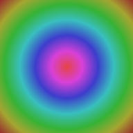

# Images

`mat` auto-detects the host terminal's image protocol and dispatches to the right encoder. Every image below is a deterministic PNG/JPEG generated by `cargo run --example gen_demo_images`, so the output is byte-reproducible across machines.

---

## Rainbow gradient (PNG, 400 × 80)


---

## Color mosaic (PNG, 288 × 192)

A grid of 24 flat tiles — reads identically in full-color, half-block, and Sixel renderers because each tile is a single solid RGB color.


---

## Bar chart (PNG, 320 × 160)


---

## Logo glyph with alpha (PNG, 240 × 240)


---

## Radial gradient (JPEG, 192 × 192)

JPEG is routed through the same pipeline as PNG, exercising the `jpeg` feature of the `image` crate.



---

## Image inside a table cell

Images inside tables are buffered safely — no viuer bytes leak above the table border. The placeholder text is the alt text.

| Label       | Image                                 | Notes                 |
| :---------- | :------------------------------------ | :-------------------- |
| Gradient    |   | PNG, 400×80           |
| Logo        |          | PNG with alpha        |
| Photo       |            | JPEG                  |

---

## Remote images

`mat` downloads `http://` and `https://` images transparently (16 MiB cap, 10-second timeout, SSRF-guarded against loopback / RFC1918).

Disable all images globally:

```bash
mat --no-images examples/images.md
```

When image rendering is off (or the protocol is `None`), every `` collapses to a dim `[image: alt]` placeholder so the surrounding text still flows.
